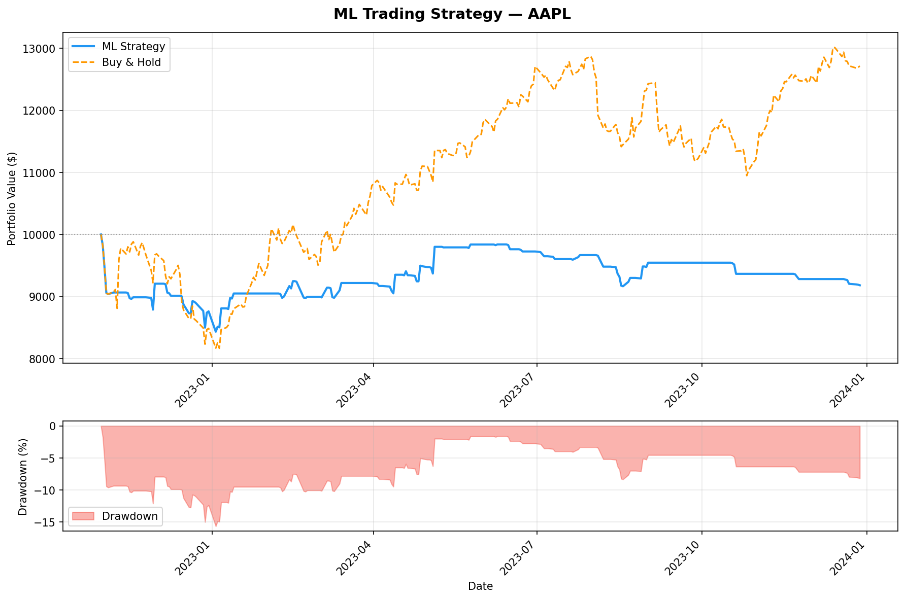

# ML Quant Trading Strategy

An end-to-end machine learning pipeline for stock trading — from raw price data to backtested performance metrics. Built as a portfolio project demonstrating production-style Python, feature engineering, and quantitative finance concepts.

---

## Results (AAPL, Oct 2022 – Dec 2023)

| Metric | Strategy | Benchmark (Buy & Hold) |
|---|---|---|
| Cumulative Return | -8.18% | +27.16% |
| Annualized Return | -7.10% | — |
| Sharpe Ratio | -0.48 | — |
| Max Drawdown | -15.66% | — |
| Win Rate | 11.11% | — |
| Total Trades | 41 | — |

## Equity Curve


> **Note:** The strategy underperformed buy-and-hold in this test period (Oct 2022–Dec 2023), which coincides with a strong recovery rally for AAPL after the 2022 bear market. The model — trained predominantly on 2018–2022 data including the bear market — was cautious during a period that rewarded aggression. This is an honest result, not a bug. See [Limitations](#limitations) for discussion.

---

## Project Structure

```
ml-quant-trading-strategy/
│
├── data/                          # Cached CSV files (auto-created)
├── models/                        # Saved model bundles (auto-created)
├── notebooks/
│   └── exploration.ipynb          # EDA and feature analysis
│
├── src/
│   ├── data_loader.py             # Download, cache, clean OHLCV data
│   ├── features.py                # Technical indicators + target variable
│   ├── model.py                   # Train, evaluate, save/load classifier
│   ├── strategy.py                # Convert probabilities → trading signals
│   ├── backtest.py                # Simulate strategy, build equity curve
│   └── metrics.py                 # Sharpe, drawdown, win rate, etc.
│
├── results/
│   ├── equity_curve.png           # Strategy vs benchmark chart
│   ├── equity_curve.csv           # Daily portfolio values
│   ├── trade_log.csv              # Per-trade entry/exit details
│   └── performance_metrics.json   # All metrics as JSON
│
├── requirements.txt
├── main.py                        # Pipeline entry point
└── README.md
```

---

## Pipeline Overview

```
yfinance
   ↓
data_loader.py   →   Clean OHLCV DataFrame
   ↓
features.py      →   Feature matrix (X) + binary target (y)
   ↓
model.py         →   Trained XGBoost/RandomForest classifier
   ↓
strategy.py      →   Signal series (+1 long / 0 flat)
   ↓
backtest.py      →   Equity curve + trade log
   ↓
metrics.py       →   Performance report + JSON
```

---

## Features Engineered

| Group | Features |
|---|---|
| Momentum | RSI-14 |
| Trend | SMA-20, SMA-50, EMA-20, price-to-MA ratios, SMA20/SMA50 ratio |
| MACD | MACD line, signal line, histogram |
| Volatility | Rolling 20-day return std, ATR-14, ATR% |
| Memory | Lagged returns at t-1, t-2, t-3, t-4, t-5 |

**Target variable:** `1` if `Close[t+1] > Close[t]`, else `0` (binary classification).

---

## Strategy Logic

The model outputs `P(UP)` — probability that tomorrow's close will be higher than today's. The strategy converts this into a position:

```
P(UP) > 0.55  →  +1  (go long)
P(UP) < 0.45  →   0  (hold cash)  [short selling disabled by default]
0.45 ≤ P(UP) ≤ 0.55  →  0  (uncertain — stay flat)
```

The dead zone (0.45–0.55) prevents overtrading when the model is uncertain. Position uses a one-day lag to enforce no lookahead bias:

```
return[Tuesday] = position[Monday] × price_return[Tuesday]
```

---

## Key Design Decisions

**No data leakage.** The `StandardScaler` is fit only on training data and applied (not re-fit) on test data. The chronological train/test split (80/20) never shuffles. The target variable uses `shift(-1)` so each row only contains information available at market close.

**No survivorship bias.** Testing is explicitly scoped to named tickers over a stated period. Results are reported honestly including underperformance.

**Transaction costs included.** A 0.1% one-way cost is applied on every position change, making the backtest more realistic.

---

## Setup

**Requirements:** Python 3.9+

```bash
git clone https://github.com/yourusername/ml-quant-trading-strategy.git
cd ml-quant-trading-strategy
pip install -r requirements.txt
```

---

## Usage

**Run the full pipeline with defaults (AAPL, 2018–2024):**

```bash
python main.py
```

**Custom ticker and date range:**

```bash
python main.py --ticker MSFT --start 2019-01-01 --end 2024-01-01
```

**Adjust signal threshold (less selective = more trades):**

```bash
python main.py --buy-threshold 0.52
```

**Force RandomForest instead of XGBoost:**

```bash
python main.py --no-xgboost
```

**Re-download data (bypass cache):**

```bash
python main.py --force-download
```

**All options:**

```
--ticker            Ticker symbol (default: AAPL)
--start             Start date YYYY-MM-DD (default: 2018-01-01)
--end               End date YYYY-MM-DD (default: 2024-01-01)
--train-ratio       Train/test split (default: 0.80)
--buy-threshold     P(UP) threshold for BUY signal (default: 0.55)
--initial-capital   Starting portfolio in USD (default: 10000)
--no-xgboost        Use RandomForest instead of XGBoost
--force-download    Bypass local CSV cache
```

---

## Metrics Explained

| Metric | Formula | Interpretation |
|---|---|---|
| **Cumulative Return** | `(final / initial) - 1` | Total % gain/loss |
| **Annualized Return** | `(1 + cum_ret)^(252/n) - 1` | Return scaled to 1 year |
| **Sharpe Ratio** | `mean(excess) / std(excess) × √252` | Return per unit of risk. >1 good, >2 excellent |
| **Max Drawdown** | `min(equity / cummax(equity) - 1)` | Worst peak-to-trough loss |
| **Win Rate** | `profitable_days / active_days` | % of long days that were up |
| **Profit Factor** | `sum(gains) / abs(sum(losses))` | >1 means more won than lost |

---

## Limitations

- **Long-only strategy.** The model only predicts UP/DOWN — it does not short sell. In bear markets, the only options are long or flat.
- **Single ticker.** Results are specific to one stock and one time period. Generalisation to other tickers is not guaranteed.
- **Binary position sizing.** The strategy is either fully in or fully out. There is no scaling of position size based on confidence.
- **No regime detection.** The model does not know whether the market is in a bull or bear regime. A model trained mostly on bull market data may underperform in corrections.
- **2022–2023 test period.** AAPL fell ~27% in 2022 then recovered strongly. The model learned caution from the downturn but missed the recovery — a structural limitation of a fixed train/test split.

---

## Future Work

- [ ] Position sizing using Kelly Criterion or volatility scaling
- [ ] Pyramiding / scaling in on high-confidence signals
- [ ] Short selling support (`position = -1`)
- [ ] Multi-ticker portfolio with correlation-based weighting
- [ ] Regime detection (HMM or rolling volatility filter)
- [ ] Walk-forward validation instead of a single train/test split
- [ ] Hyperparameter tuning with `TimeSeriesSplit` cross-validation
- [ ] Alternative models: LSTM, LightGBM, ensemble

---

## Tech Stack

| Purpose | Library |
|---|---|
| Data | `yfinance`, `pandas` |
| Feature engineering | `pandas-ta`, `numpy` |
| Machine learning | `xgboost`, `scikit-learn` |
| Visualisation | `matplotlib` |
| Model persistence | `joblib` |

---

## License

APACHE 2.0